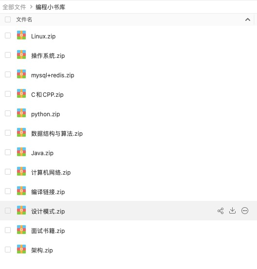

<h1 align="center">这里是小书库，包含计算机专业各类经典书籍</h1>

**简介:**

> 这个仓库包含了计算机各个方向的经典书籍：比如C/C++、Java、Python、操作系统、计算机网络、设计模式等等，目前大部分都是笔者学习过程中用到或者触及的书籍，后续也越来越完善，力争达到想要读书时，手头就有书可读。

**本仓库持续更新中....**

- **[一键领取小书库所有书籍](#全部汇总)**

# 书库导航

- [计算机体系基础](#计算机系统基础)
    - [操作系统](#操作系统)
    - [编译原理](#编译原理)
    - [计算机网络](#计算机网络)
    - [计算机组成原理](#计算机组成原理)
- [数据结构与算法](#数据结构与算法)
- [Liunx](#Liunx)
- [架构](#架构)
- [数据库和存储](#数据库和存储)
- [C/C++](#C/C++)
- [Java](#java)

- [面试书籍](#面试书籍)
- [Python](#Python)
- [设计模式](#设计模式)
- [全部汇总](#全部汇总)
- [免责声明](#免责声明)
---

# 计算机系统基础

### 操作系统
- 计算机的心智操作系统之哲学原理	[百度网盘链接](https://pan.baidu.com/s/1J-LfN1J_IAGWlsqVM3EPgw)  密码:1m5v
- 计算机是怎样跑起来的	[百度网盘链接](https://pan.baidu.com/s/1-hIFaMYSxkGzxAWEUtpBdA)  密码:ro6l
- Orange's一个操作系统的实现	[百度网盘链接](https://pan.baidu.com/s/1mt6zC7jBB2Hi0tjHm89KIw)  密码:yk2q
- 深入理解计算机系统	[百度网盘链接](https://pan.baidu.com/s/1TuyRrnm7wNLz5rxhgvY9EA)  密码:l8re
- 操作系统之哲学原理 第2版	[百度网盘链接](https://pan.baidu.com/s/14_XybHk1PDefvYhVoG_w_g)  密码:dugz
- 一个64位操作系统的设计与实现	[百度网盘链接](https://pan.baidu.com/s/1i67hZpDetAPnuJBKXFNAOw)  密码:rc3m
- 自己动手写操作系统	[百度网盘链接](https://pan.baidu.com/s/1u_ilFtUxZ8ssxCklKyHvjw)  密码:kfbx
- 程序是怎样跑起来的	[百度网盘链接](https://pan.baidu.com/s/1fmopzYftvxFVfSzmNOLueg)  密码:6obs
- 30天自制操作系统.(川合秀实).周自恒等.扫描版	[百度网盘链接](https://pan.baidu.com/s/1FS8VH56PL0qyOOG8Et8eNw)  密码:pskx
- 操作系统设计与实现	[百度网盘链接](https://pan.baidu.com/s/1ag85hdhJPVaCK2K81TcLBg)  密码:cgzt

### 编译原理
- 自制编程语言	[百度网盘链接](https://pan.baidu.com/s/1BWkUEBsTZD_HwWm6qo0RTg)  密码:1hlw
- 编译原理(龙书) 第二版	[百度网盘链接](https://pan.baidu.com/s/1c4TS29hUP0Frf5c8-cKBhw)  密码:o33o
- 穿越计算机的迷雾	[百度网盘链接](https://pan.baidu.com/s/1PDb0e1hc6Qv_1V4Kfty5cw)  密码:4hmz
- 《[百度网盘链接](和加载器》中译本	[百度网盘链接](https://pan.baidu.com/s/1TUm9Qn0UiQcyCfaFnSFY8g)  密码:g6we
- Understanding_ELF	[百度网盘链接](https://pan.baidu.com/s/1uyOcRdLtROfr1heCWxuwFQ)  密码:qzb0
- 编译原理（高清龙书中文版）	[百度网盘链接](https://pan.baidu.com/s/1tAlvc-FLXSrhgcZ3dtRNtw)  密码:3uo6
- 编译系统透视  图解编译原理_552886	[百度网盘链接](https://pan.baidu.com/s/1stSeuBnyIz-2kWubEKj2Tw)  密码:hgk6
- 程序员的自我修养--[百度网盘链接](装载与库(高清带完整书签版)	[百度网盘链接](https://pan.baidu.com/s/1ghCZYrWECBrsf08mqEpz4A) 密码:d9mj

### 计算机网络
- Wireshark网络分析的艺术	[百度网盘链接](https://pan.baidu.com/s/15-WYSDqNaEH3tFpDQGQyTQ)  密码:9l23
- Wireshark网络分析就这么简单	[百度网盘链接](https://pan.baidu.com/s/1y15ZQKx6sjloRj0oHuSTxQ)  密码:wl32
- Wireshark数据包分析实战	[百度网盘链接](https://pan.baidu.com/s/1DhZLD8qnY6V33MkcAUaFFg)  密码:qcp9
- 图解tcpip(第5版)	[百度网盘链接](https://pan.baidu.com/s/1TQtRZlmeW5PwWqOhG_6Fow)  密码:7qjl
- tcp源码分析	[百度网盘链接](https://pan.baidu.com/s/1psuPkfd-fQ6EnX3E42PgEw)  密码:atpd
- 图解HTTP	[百度网盘链接](https://pan.baidu.com/s/1UKWi1JMnDaiy1eD37NXEoQ)  密码:dliw
- 计算机网络-自顶向下方法	[百度网盘链接](https://pan.baidu.com/s/1LRnIQj9PxZfFJIbXMzTl9g)  密码:i42t
- 网络是怎样连接的	[百度网盘链接](https://pan.baidu.com/s/1y_F0rgIRYAOj7gEXBonRKg)  密码:9fql
- HTTP权威指南[文字版][中文版]	[百度网盘链接](https://pan.baidu.com/s/1hg9E_5BtnswP9pnYKPILIw)  密码:zuwo

# 数据结构与算法
- 编程之法	[百度网盘链接](https://pan.baidu.com/s/1HEJFC9-hHGM1DlZLv465gA)  密码:vyjf
- 算法图解	[百度网盘链接](https://pan.baidu.com/s/1yAqcJhzZ9FAn0U-D5CYhqg)  密码:6l9n
- 编程珠玑 第二版 人民邮电出版社	[百度网盘链接](https://pan.baidu.com/s/1R3ZoXnrFF9ZVvabjNYLYxA)  密码:en7o
- 数据结构与算法分析--C语言描述	[百度网盘链接](https://pan.baidu.com/s/1vs3edsQZE883hzU8i7YsUg)  密码:sgtf
- 背包九讲	[百度网盘链接](https://pan.baidu.com/s/1ARmU9xM1psx4FUPFsGNxhw)  密码:oo3h
- 编程之美——微软技术面试心得	[百度网盘链接](https://pan.baidu.com/s/1jw2D-V4GfyitHbI07hyaiQ)  密码:gdmd
- 啊哈！算法	[百度网盘链接](https://pan.baidu.com/s/1lDOV1shZgR2sTldpsAGYnA)  密码:kns1
- 算法第四版	[百度网盘链接](https://pan.baidu.com/s/1vwZQnvVuaAYUYgts-4GE6A)  密码:l18r
- 大话数据结构	[百度网盘链接](https://pan.baidu.com/s/1eYPWQbJ_nFdeyA7JmMoC0A)  密码:6lwi
- 数据结构与算法分析——Java语言描述	[百度网盘链接](https://pan.baidu.com/s/1vMYRGKGThInOOXAswgYTOg)  密码:nxii
- 算法导论中文第三版	[百度网盘链接](https://pan.baidu.com/s/12Vz-2WP0d7p5_Yf0Nw0ecw)  密码:8h52

# Liunx
- Linux内核完全注释	[百度网盘链接](https://pan.baidu.com/s/1RYNwlzb9m7gQfuihxI6xHg)  密码:sf7w
- UNIX编程艺术-中文版【The+Art+of+UNIX+Programming】	[百度网盘链接](https://pan.baidu.com/s/1jon1CJ-ETG7TvkgdVQa5XQ)  密码:zg9a
- Linux命令行与Shell脚本编程大全	[百度网盘链接](https://pan.baidu.com/s/1uVtYrZ0XnDqxjoJAQxb0ew)  密码:rmvz
- Linux程序设计 中文第4版	[百度网盘链接](https://pan.baidu.com/s/1Z-dkCySYl0uSpCUcspo6kg)  密码:1s63
- 鸟哥的Linux私房菜	[百度网盘链接](https://pan.baidu.com/s/1ZH0BS1dku9VOgZRBnK6shw)  密码:44oe
- Windows内核原理与实现	[百度网盘链接](https://pan.baidu.com/s/1Lxr6iLZ1223mXLu8klF7nQ)  密码:3u9r
- 深入理解linux内核中文第三版	[百度网盘链接](https://pan.baidu.com/s/1xzdChDl2jmmboWNdW17Mow)  密码:mv5t
- linux内核源代码情景分析	[百度网盘链接](https://pan.baidu.com/s/10u1loXplyZXDUeBTQyYQnw)  密码:nfpf
- Linux内核设计与实现(第三版中文高清带目录)	[百度网盘链接](https://pan.baidu.com/s/1u4RkpMductTlak8Z_WEK6A)  密码:qeyv
- 《Linux内核完全剖析基于0.12内核》 (带目录可注释)	[百度网盘链接](https://pan.baidu.com/s/1e8EUPZxZUaASLH7HOUFPew)  密码:2brp
- 深入Linux内核架构	[百度网盘链接](https://pan.baidu.com/s/1FBbGdwyVZvy1DuEgV66I_g)  密码:npvz
- UNIX 环境高级编程版	[百度网盘链接](https://pan.baidu.com/s/1gsIi48Lgsa5RXJBFRfz4KA)  密码:l5lw
- Linux-UNIX系统编程手册（上、下册）	[百度网盘链接](https://pan.baidu.com/s/1ae29VSMtLlhKw8OXFRCl7Q)  密码:0x7v
- Linux高性能服务器编程	[百度网盘链接](https://pan.baidu.com/s/13uRoWFLMImfAR_lMLAkjQQ)  密码:4ozv
- 后台开发 核心技术与应用实践	[百度网盘链接](https://pan.baidu.com/s/1CHq_sOJAeng-tqrw71jkMw)  密码:93x4
- Linux网络编程	[百度网盘链接](https://pan.baidu.com/s/1Xs6yKmwMC-Gj7YhKxYa-qg)  密码:4057
- Linux多线程服务端编程	[百度网盘链接](https://pan.baidu.com/s/1yUarkw-KjR-1TnLaKFu7OQ)  密码:xlw4
- UNIX网络编程_卷2_进程间通信	[百度网盘链接](https://pan.baidu.com/s/1jf1f2xdq5dUQhcPz6C4F7w)  密码:y96x
- UNIX网络编程_卷1_套接字联网API	[百度网盘链接](https://pan.baidu.com/s/1m1BGzsjG1yDpy99bCMazVA)  密码:og7o
- Linux高性能服务器编程	[百度网盘链接](https://pan.baidu.com/s/1Xq2zBnSUxI66U6WdSl6qhw)  密码:sp78
- TCP IP网络编程(韩)尹圣雨	[百度网盘链接](https://pan.baidu.com/s/1IP1JtJdy2PncA2ec-dzsOw)  密码:a287
 

# 架构
- 大型网站技术架构_核心原理与案例分析_李智慧	[百度网盘链接](https://pan.baidu.com/s/1n5kWb6YO--V2Cpn9355PZA)  密码:bmb4
- 软件架构方面	[百度网盘链接](https://pan.baidu.com/s/1q3qrNatCB7qvmVIhfu4o2Q)  密码:15fs
- 大型分布式网站架构设计与实践.带目录书签.完整版	[百度网盘链接](https://pan.baidu.com/s/1XZiG4PLsKqovDcS5O2zOQw)  密码:1c7y

# 数据库和存储

- Redis设计与实现	[百度网盘链接](https://pan.baidu.com/s/18vMms6-b_W_MvJ5MddLNHA)  密码:wuaq
- REDIS 入门指南	[百度网盘链接](https://pan.baidu.com/s/1Uzdhzt--t_LDDKaIWWDaGQ)  密码:8s1u
- Redis源代码分析	[百度网盘链接](https://pan.baidu.com/s/1IVKZ3_iGpeR9P90y7MryJw)  密码:2bsd
- MySQL必知必会	[百度网盘链接](https://pan.baidu.com/s/1Wq5QBiU9_ACU8ybHo7CsHA)  密码:ljk4
- 高性能MySQL-第3版	[百度网盘链接](https://pan.baidu.com/s/1FsK-Vygr92L1ZxfNdXk55Q)  密码:dtan
- MySQL技术内幕  InnoDB存储引擎  第2版	[百度网盘链接](https://pan.baidu.com/s/1B0a6IKVQWFgwzX_xDMOepQ)  密码:5y3r

# C/C++
- 深度探索C++对象模型 PDF中文清晰版	[百度网盘链接](https://pan.baidu.com/s/1Iw4iNPmL53qo61uFEqUmDQ)  密码:8izb
- C++性能优化指南	[百度网盘链接](https://pan.baidu.com/s/1zs6M8VQ4Cx3iupY2o2w9nA)  密码:fca6
- 深入理解c11(c11新特性解析与应用)	[百度网盘链接](https://pan.baidu.com/s/1qRaCN7bE9TVtjr7s18E-VA)  密码:v9cq
- STL源码剖析--侯捷	[百度网盘链接](https://pan.baidu.com/s/1MFW_Z2EKB6qpIt0iEEanYA)  密码:iq4p
- Effective.Modern.C++ - 英文版	[百度网盘链接](https://pan.baidu.com/s/1Y_VQ6QPXeB8YpIZaPJY-3A)  密码:bu50
- EffectiveC++中文版（第三版）	[百度网盘链接](https://pan.baidu.com/s/10Vd65-zIo-0oYOm5rQR1kA)  密码:5etm
- More Effective C++中文	[百度网盘链接](https://pan.baidu.com/s/1boRsNd-QpT-_huwvU9La8w)  密码:gu8l
- Effective.Modern.C++ - 中文版	[百度网盘链接](https://pan.baidu.com/s/1dKuj3b5AP5Fk1tkJy2hyPQ)  密码:5na2
- Effective+STL中文版：50条有效使用STL的经验	[百度网盘链接](https://pan.baidu.com/s/1yVkpJxLu4dAnyIAyddXBGA)  密码:f7vy
- C++ Primer 第五版--- 高清版	[百度网盘链接](https://pan.baidu.com/s/1q1jqIh9JvGXwAEnADt9tcw)  密码:aus1
- C陷阱与缺陷	[百度网盘链接](https://pan.baidu.com/s/1dJmM60l2KyJfjD0Ky7fDCQ)  密码:ti2j
- C Primer Plus（第五版） 	[百度网盘链接](https://pan.baidu.com/s/1Oe_d4yRXyPQ6ycjy46JoPw)  密码:pknb
- C和指针	[百度网盘链接](https://pan.baidu.com/s/176KdvPHTLsNfjC4QfAGHLw)  密码:h2x3
- C专家编程	[百度网盘链接](https://pan.baidu.com/s/1_S9URzcQQz-IAaN_O4t64Q)  密码:sl12

# Java
- Java编辑思想（第四版）	[百度网盘链接](https://pan.baidu.com/s/1u0EmhS5kqIdIwNi66OebCw)  密码:9h09
- 代码整洁之道	[百度网盘链接](https://pan.baidu.com/s/1H7t6YkLEundh3kkst4SgPQ)  密码:n8m1
- 深入理解Java虚拟机（第二版-带目录）	[百度网盘链接](https://pan.baidu.com/s/11o-E5FZzmfKcr5bBjBSOaw)  密码:zusq
- Effective+Java+中文第二版	[百度网盘链接](https://pan.baidu.com/s/1R-FbhO_VrVyqOKQtj89mkg)  密码:nb2i
- JAVA并发编程实践	[百度网盘链接](https://pan.baidu.com/s/17GkkeSVlIsBOusMmSEQ8SA)  密码:8kzh
- Java核心技术(卷1）第8版	[百度网盘链接](https://pan.baidu.com/s/1lRADdc2sPrC4bdSfzqxjSw)  密码:yyd8
- Java核心技术（卷2）第8版	[百度网盘链接](https://pan.baidu.com/s/1cUNCKQm6-1Z1pCX65jYjxg)  密码:q8hm

# 面试书籍

- 程序员面试宝典	[百度网盘链接](https://pan.baidu.com/s/128sgwHi9STKC_pMJrykw7A)  密码:jy9j
- 程序员代码面试指南 IT名企算法与数据结构题目最优解 ,左程云著 ,P513	[百度网盘链接](https://pan.baidu.com/s/1JynWak0UdgovrrGnHpyw4w)  密码:yeg8
- 剑指offer 名企面试官精讲典型编程题	[百度网盘链接](https://pan.baidu.com/s/1GCRLYEGSaquQDq8SVx2ozQ)  密码:gadq
- 牛客校招面试题C++篇	[百度网盘链接](https://pan.baidu.com/s/1riUYYwtLOSwAY3GLxj5yFQ)  密码:5st7
- JAVA核心面试知识整理	[百度网盘链接](https://pan.baidu.com/s/12dxxa-OSrb7Ws6YzEbX2Iw)  密码:7gh6
- C++ 面试题库	[百度网盘链接](https://pan.baidu.com/s/1seyTuqeviR4XY0TY0N5fVg)  密码:38mn

# Python
- Flask-Web开发：基于Python的Web应用开发实战	[百度网盘链接](https://pan.baidu.com/s/1knJYlc0VpYFUVhTkQp-mZg)  密码:tnp2

# 设计模式
- 大话设计模式	[百度网盘链接](https://pan.baidu.com/s/1YSP4qku3nIQpe9ibYldmyw)  密码:79io

# 全部汇总

目前我把书籍的PDF都暂时放在公众号【ConeZhang】里面了，扫码关注下面公众号，回复「小书库」
就有我收集的上百本经典计算机书籍，包含各个方向：

**微信扫描上方二维码回复「小书库」**

# 免责声明

书籍全部来源于网络其他人的整理，这里只是收集整理了他们的链接，如有侵权，马上联系我，我立马删除对应链接。我的邮箱：1525163730@qq.com
